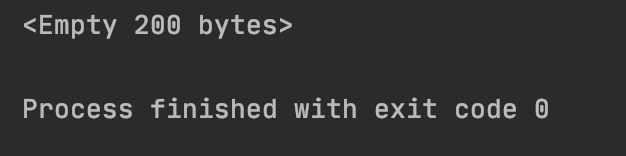
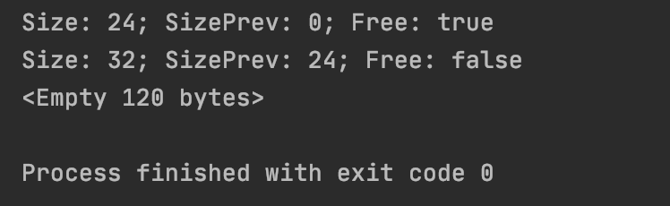

# Lab 1 - Allocator
## DESCRIPTION
## About allocator

A general purpose memory allocator must do at least **three tasks**: 
***allocating** a block of memory* of a given size, ***freeing** the allocated memory block* and 
***resizing** the allocated memory block*. These functions constitute a general purpose memory allocator interface.

Each block has a **header** and the **data**. Header always has a fixed size of **12 bytes**.
All blocks are **4-byte** aligned.
That means, to allocate **8 bytes** of memory, we need at least **24 bytes** of free memory. The structure of header:
> [memory size(4 bytes), previous block memory size(4 bytes), boolean is block free(1 byte), placeholder(3 bytes)]

### Algorithm description

#### Allocate function
```
void* mem_alloc(size_t size)
```

When the `mem_alloc` function has called, it searches for the block of free memory, 
satisfying the size criteria (the size of that free block has to be at least `size` + `HEADER_SIZE`). 
If it found such - it occupies the block, if it didn't - it returns the `null`.

### Reallocate function
```
void* mem_realloc(void* addr, size_t size)
```

This function calls first of all decides, if it has to make the block smaller or bigger.

***If the block is going to become smaller***, and the rest of the memory is enough to create a new block (including new header), the current memory block will be split into two: 
the *'new data'* block, and the *'freed memory'* block. Then the `mem_free` function has called 
(*'freed memory'* block pointer has passed there as an argument).

***If the block is going to become bigger or smaller, but the rest of the memory isn't enough to split***, new block is allocated, and current block is getting free. New pointer is returned.

### Free memory function
```
void mem_free(void* addr)
```

The function flags block as *'free'* block and tries to merge with adjacent *'free memory'* blocks, if present.

## DEMONSTRATION

>All memory state outputs are made with the `mem_dump` function, which, basically, 
>goes through 'our' heap and prints the states of all the existing blocks.

### Creation of our allocator
#### In this example we create new allocator with *200* bytes memory
##### Code
```
Allocator allocator = new Allocator(200);
```

##### Output

---

### The allocation of *5* bytes of memory
#### Exception will be thrown
##### Code
```
Allocator allocator = new Allocator(200);
int ind = allocator.alloc(5);
```

##### Output

---

### The allocation of *24* and *32* bytes of memory
#### Memory will be successfully allocated
##### Code
```
Allocator allocator = new Allocator(200);
int ind1 = allocator.alloc(24);
int ind2 = allocator.alloc(32);
System.out.println(allocator.dump());
```

##### Output

---

### The freeing of *24* bytes of memory
#### Optimize method split a large block into smaller for reuse
##### Code
```
try {
    allocator.free(ind1);
} catch (InvalidIndexException err) {
    System.err.println(err);
}
System.out.println(allocator.dump());
```

##### Output

---

### The allocating of *24* and *32* bytes of memory
#### Blocks will be combined into one block
##### Code
```
try {
    allocator.free(ind1);
    allocator.free(ind2);
} catch (InvalidIndexException err) {
    System.err.println(err);
}
System.out.println(allocator.dump());
```

##### Output

---

### The allocating of *24* bytes of memory and then realloc it
#### Increasing the block will free current and allocate a new one
##### Code
```
try {
    allocator.realloc(ind1, 48);
} catch (InvalidIndexException err) {
    System.err.println(err);
}
System.out.println(allocator.dump());
```

##### Output

