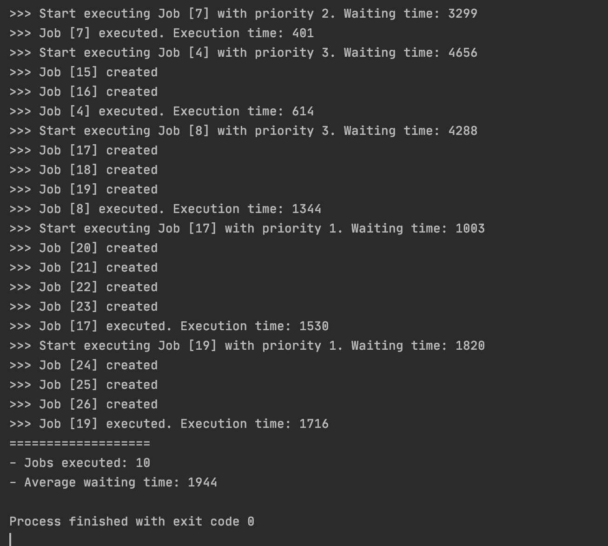
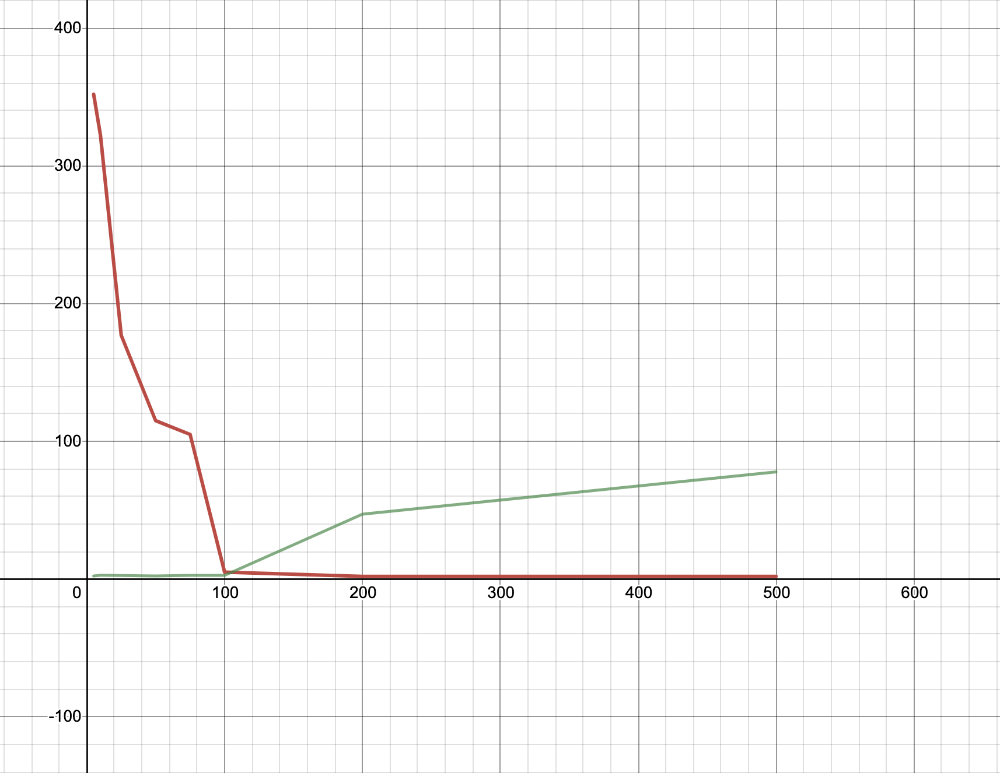

# Система обслуговування заявок при обмежених ресурсах
Implemented in `Java`.

Алгоритм: FIFO with priorities.

## Загальний принцип роботи
Алгоритм обслуговування черг Firstin, Firstout (FIFO), також званий First Come First Served є найпростішим. 
FIFO є найбільш простою стратегією планування процесів і полягає в тому, що ресурс передається тому процесу, котрий раніше всіх інших звернувся до нього.
Коли процес потрапляє в чергу готових процесів, process control block приєднується до хвоста черги.
Середній час очікування для стратегії FIFO є часто досить великим і залежить від порядку надходження процесів в чергу готових процесів.  

Дисципліна обслуговування FIFO з пріоритетами без витіснення припускає, що кожна заявка має свій пріоритет. Заявки з однаковими пріоритетами групуються в чергу типу FIFO. Спочатку обслуговується черга з вищим пріоритетом. Заявка, що потрапила в процесор не може бути витіснена з нього поки не завершиться її обслуговування.

## Приклад роботи

## Графіки

На даному графіку зображено залежність середнього часу очікування від інтенсивності вхідного потоку у мілісекундах (тобто інтервалу виникнення нової заявки).
Час виконання однієї заявки - 100 мілісекунд.

На **осі Х** показано із якою періодичністю (через який інтервал часу) додавалася нова задача до менеджера.

На **осі Y**:

* Червоним кольором показано середній час очікування
* Зеленим кольором показано процент простою системи
