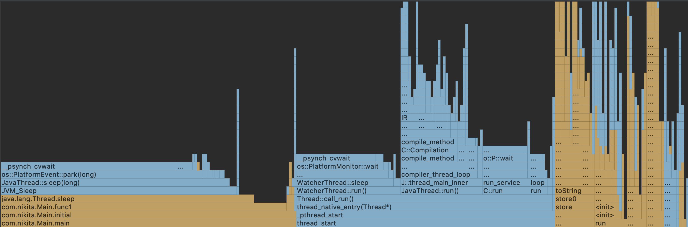
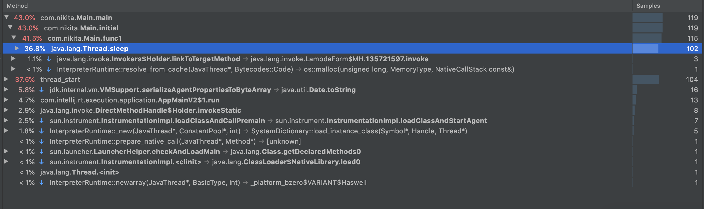

# Профілювання програм

Мною було проведено CPU профілювання вихідного коду за допомогою інструменту Async Profiler, інтегрованого в IDE IntelliJ IDEA.

## Результати профілювання

### Flame graph

### Call tree
